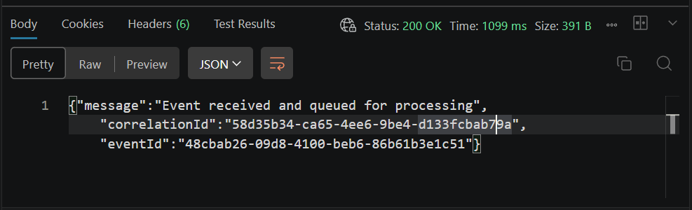
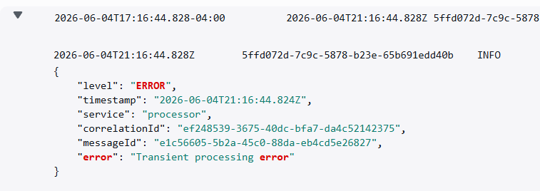
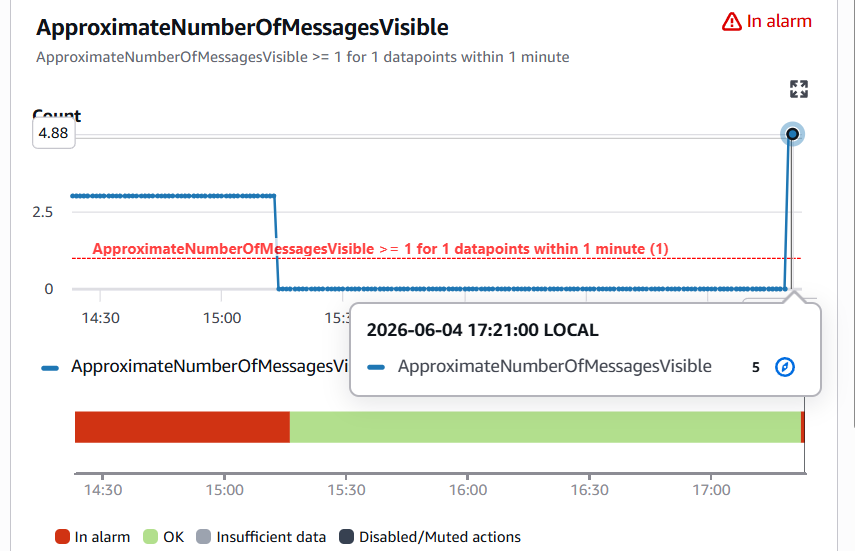
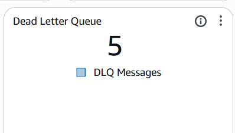
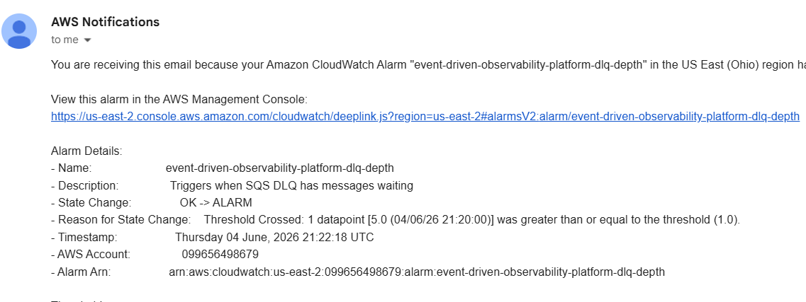

# DLQ Incident

## Overview

This incident documents messages that repeatedly fail processing and are moved to the SQS Dead Letter Queue (DLQ). It outlines causes, observable evidence, impact on business flows, root cause analysis, and recommended resolution steps.

## Causes

- Transient processing errors (e.g., temporary downstream failures, throttling).
- Unhandled exceptions in the `processor` Lambda that are not classified as permanent errors.
- Missing metric emitted when a message lands in the DLQ (no `EventDeadLettered` metric currently).

## Scenario

```json
{
  "eventId": "123456abcde",
  "eventName": "Order Created",
  "eventType": "OrderCreated",
  "failTransient": true,
  "payload": {
    "order_id": "order_123",
    "customer_id": "customer_123",
    "amount": 149.9,
    "currency": "USD"
  }
}
```

## Expected Behavior

When an event is ingested the system should either:

- Process it successfully and emit `EventProcessed`, or
- Reject it with `EventRejected` (for schema issues), or
- Mark it as duplicate with `EventDuplicated`.

If an event exhausts retries and moves to the DLQ, the system should isolate it for investigation or replay. A future observer could emit `EventDeadLettered` as an operational metric for messages moved to the DLQ.

## Evidence

- CloudWatch logs from the `processor` Lambda showing repeated exceptions and `EventRetried` metrics per attempt.
- CloudWatch DLQ metric or SQS attributes showing non-zero message count in `event-driven-observability-platform-events-dlq`.

- Sample HTTP response (image 01) shows a `correlationId` and `eventId` for the ingested event.
- CloudWatch logs (image 02) show an ERROR with message `Transient processing error` for a processor record.
- CloudWatch alarm (image 03) `event-driven-observability-platform-dlq-depth` fired; dashboard single-value (image 04) shows DLQ messages = 5 and the SNS notification (image 05) contains the alarm details.

### Invalid Request / API Response



### CloudWatch Logs



### CloudWatch Alarm



### CloudWatch Dashboard Metric



### SNS Alarm Notification



## Impact

- Messages in the DLQ represent business events not processed (orders, notifications, analytics).
- Dashboards should not subtract `EventRetried` from unresolved-event calculations because retries are intermediate attempts, not final outcomes.
- Customer-facing processes that rely on these events may be delayed or left incomplete.

## Root Cause

The processor emits `EventRetried` on each transient failure, but retry attempts are not final event outcomes. DLQ depth is tracked separately with SQS metrics, and unresolved events are calculated without subtracting retries.

## Resolution

Short-term actions:

1. Monitor DLQ depth using the SQS attribute `ApproximateNumberOfMessagesVisible` and set an alert on the CloudWatch alarm `event-driven-observability-platform-dlq-depth`.
2. Inspect recent `processor` logs to identify the transient exception type and frequency.

Recommended long-term fix:

1. Implement a small DLQ observer Lambda that triggers on the DLQ and emits an `EventDeadLettered` metric into the `ObservabilityPlatform` namespace (EMF). Include `correlationId` and `messageId` in logs for traceability.
2. Keep unresolved events focused on outcomes currently observed by the processing pipeline:

```
UnresolvedEvents = Ingested - Processed - Rejected - Duplicated
```

3. Use `EventDeadLettered` as a separate operational metric alongside DLQ depth and verify dashboard behavior.

Notes:

- DLQ name: `event-driven-observability-platform-events-dlq` (region: `us-east-2`).
- The observer must not reprocess DLQ messages; it should emit metrics and allow messages to be deleted.
