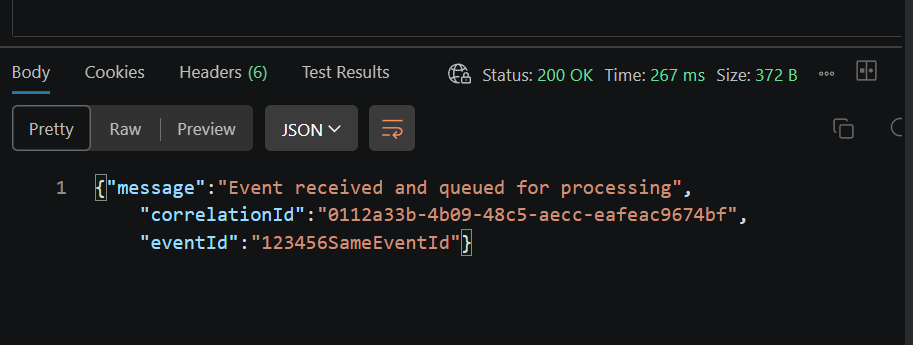
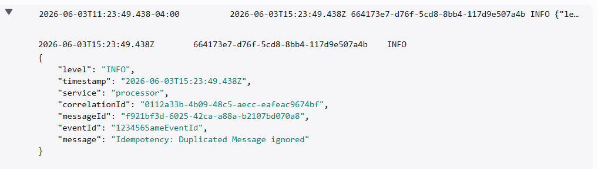

# Duplicated Event Incident (Idempotency)

## Overview

A duplicated event incident occurs when a producer sends an event that has already been ingested by the platform.

## Causes

A duplicated event can occur for several reasons, including:

- Producer retrying the same event
- Network issues causing duplicate submissions
- Processing retries (transient errors)

## Scenario

The same event is sent again by the producer, or retried by the processing layer due to transient errors, resulting in a duplicate event incident. After the message is consumed from SQS, the processor stores the `eventId` in DynamoDB as an idempotency key; duplicated events are then ignored on processor side, preventing duplicate processing and downstream side-effects.

```json
{
  "eventId": "123456SameEventId",
  "eventName": "Order Created",
  "eventType": "OrderCreated",
  "payload": {
    "order_id": "order_123",
    "customer_id": "customer_123",
    "amount": 149.9,
    "currency": "USD"
  }
}
```

## Expected Behavior

The API returns HTTP 202 Accepted, CloudWatch counts for ingested, and the SQS queue receives the event. When a duplicated event is detected by the platform, the event is skipped and duplicated events are shown in the event flow, highlighting differences between counts. The dashboard displays the duplicated-event rate (%).

## Evidence

### API Response



### Logs



### Dashboard Event Flow


### Dashboard Duplicated Rate


## Impact

Duplicated events are ingested but ignored by the platform processor, preventing duplicate processing. This prevents duplicated payments, incorrect BI reports, and helps maintain data consistency across the platform.

## Root Cause

The incident was caused by the producer sending the same event multiple times, either due to retries or network issues.

## Resolution

The producer was advised to implement idempotency keys to prevent sending duplicate events. Retry policies were adjusted to avoid unnecessary duplicate submissions. Monitoring was enhanced to detect and alert on duplicate events promptly.
