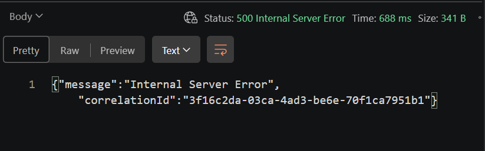
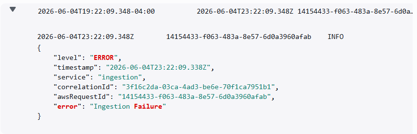
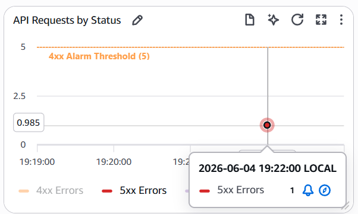
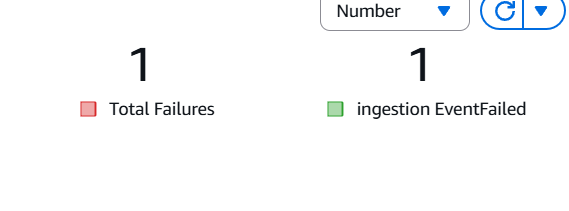

# Ingestion Failure Incident

## Overview

This incident covers server-side failures at the ingestion API that return 5xx responses and prevent events from being queued. The document summarizes the evidence, likely causes, impact, and recommended fixes.

## Causes

- Lambda resource exhaustion (concurrency limits, memory) or throttling.
- Unhandled exceptions or recent deployment regressions in the ingestion code.
- Malformed input that triggers an internal error rather than a 4xx rejection.

## Scenario

```json
{
  "eventId": "123456SameEventId",
  "eventName": "Order Created",
  "eventType": "OrderCreated",
  "forceIngestionFailure": true,
  "payload": {
    "order_id": "order_123",
    "customer_id": "customer_123",
    "amount": 149.9,
    "currency": "USD"
  }
}
```

## Expected Behavior

Valid requests should return HTTP 200 with a `correlationId` and `eventId`, and the system should emit `EventIngested`. Invalid payloads should return 4xx and emit `EventRejected`.

## Evidence

### API Response



### Logs



### Dashboard Event Flow



### Dashboard Ingestion Failure Rate



## Impact

- The event is not queued and will not reach downstream processing — orders, notifications, or analytics may be incomplete or delayed.
- Monitoring and paging may be triggered, increasing on-call workload.

## Root Cause

An unhandled server error occurred in the `ingestion` service for the recorded `correlationId`. Possible root causes include downstream service errors, resource limits, or a code regression. A precise root cause needs log and dependency inspection using the `correlationId` and timestamps.

## Resolution

Short-term actions:

1. Capture the `correlationId` from the client response and search CloudWatch logs for full stack traces.
2. Check downstream services (DynamoDB, external APIs) for errors or throttling at the incident time.
3. If the failure is caused by a recent deployment, consider rolling back or applying an emergency patch.

Long-term recommendations:

1. Ensure ingestion errors emit a clear `EventFailed` EMF metric containing `correlationId` and error type.
2. Add alerts on `EventFailed` and 5xx error rates with sensible thresholds.
3. Harden ingestion with retries/backoff, timeouts, and circuit breakers for downstream calls.

Verification:

1. Send a test ingestion request and confirm HTTP 200 and `EventIngested` metric.
2. Confirm `EventFailed` and 5xx metrics return to baseline and dashboard spikes clear.
3. Ensure downstream processors receive the event or that the failure is correctly classified.
