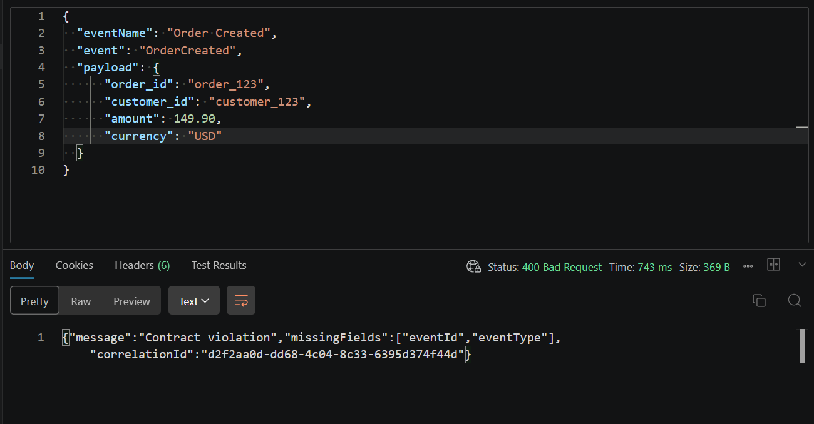
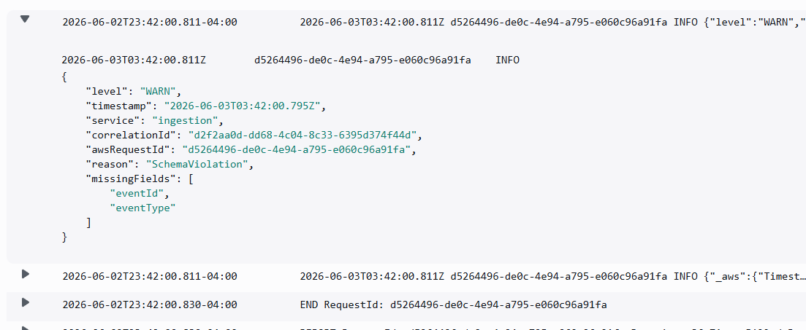
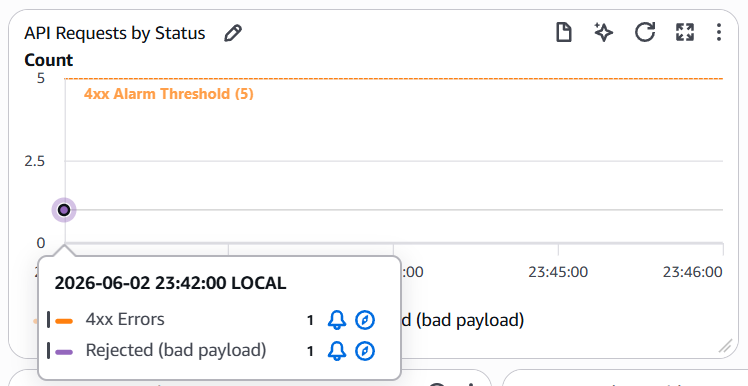

# Schema Violation Incident

## Overview

A schema violation incident occurs when a producer sends an invalid event to the platform.

The event is rejected during the ingestion phase, protecting all the pipeline stages from invalid data.

## Causes

Schema violations can occur due to various reasons, including:

- Missing required fields (EventId, EventType)
- Incorrect data types

## Scenario

The producer sends an event that does not conform to the expected schema.

- Valid Event

```json
{
  "eventId": "123456abcde",
  "eventName": "Order Created",
  "eventType": "OrderCreated",
  "payload": {
    "order_id": "order_123",
    "customer_id": "customer_123",
    "amount": 149.9,
    "currency": "USD"
  }
}
```

- Invalid Event

```json
{
  "eventName": "Order Created",
  "event": "OrderCreated",
  "payload": {
    "order_id": "order_123",
    "customer_id": "customer_123",
    "amount": 149.9,
    "currency": "USD"
  }
}
```

## Expected Behavior

When a schema violation occurs, the platform rejects the event, returns an error message, logs the incident, and counts on the alarm.

The API returns HTTP 400 Bad Request.
The ingestion logged the schema violation error.
Incident counted on the alarm.
No message processed
No message sent to SQS
No record created on DynamoDB

## Evidence

### Invalid Request / API Response



### Logs



### Cloudwatch



## Impact

The invalid event was rejected by the platform, preventing it from being processed further.
No downstream/Databases or queues were affected.

## Root Cause

The incident was caused by the producer sending an event that did not conform to the expected schema. Specifically, the event was missing the required `eventId` field and had an incorrect field name `event` instead of `eventType`.

## Resolution

The producer corrected the event schema by including the required `eventId` field and using the correct field name `eventType`. The platform then successfully ingested the event without any schema violations.
